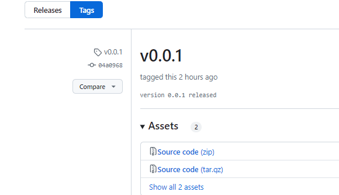
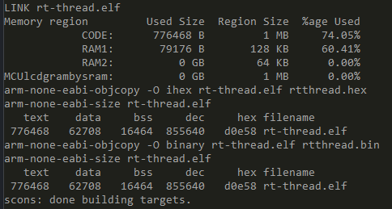
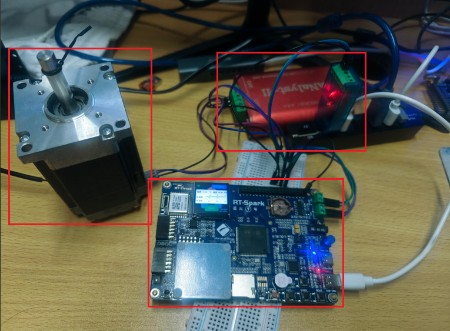
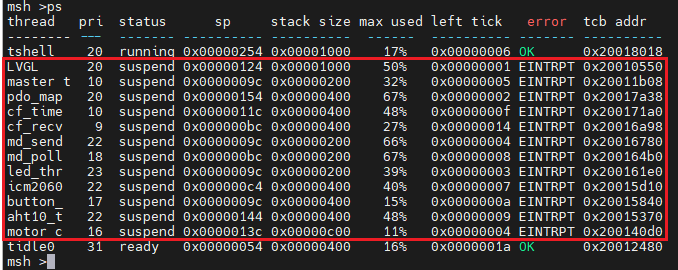
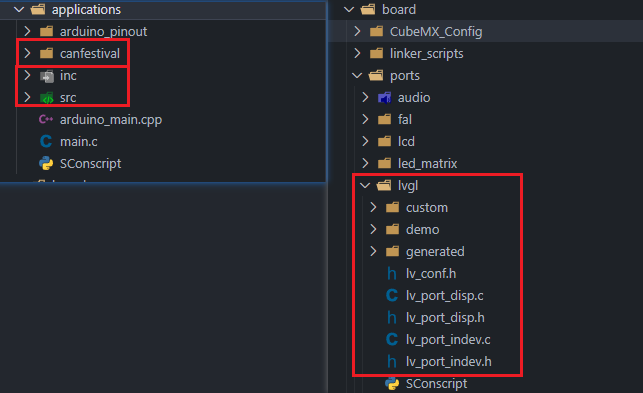

## 基于RT-Thread+LVGL+Canfestival+Freemodbus的伺服传感采集控制系统

### 0. 上手指南

在`servo_sensor_sys`分支的Releases下根据tag标签可以找到最新版本代码进行下载，如`v0.0.1`



由于.gitignore忽略了相关文件改动如`packages`，下载到源码后，需进行如下步骤：

1. 配置RT-Thread env开发环境，参考[这篇博客](https://blog.csdn.net/telegeni/article/details/140686639?spm=1001.2014.3001.5501)

2. 进入RT-Thread-0.0.1\servo_sensor_sys目录，右键打开ConEmu Here执行如下命令：

   ```python
   menuconfig.exe	# 打开退出读取配置信息
   pkgs --update	# 下载所需软件包
   scons --target=vsc	# 生成vscode配置文件
   scons -c	# 清除编译
   scons -j12	# 编译生成.elf，可能需要解决软件包找不到头文件等相关报错
   ```

3. 得到如下界面，说明无误烧录运行

   

### 1. 介绍

#### 1.1 软件版本

- `env-windows-v2.0.0`
- `openOCD-20231002-0.12.0`
- `rt-thread-v5.1.0`
- `LVGL-v8.3.11`
- FlexibleButton-latest
- aht10-latest
- icm20608-latest
- rt_vsnprintf_full-latest
- CanFestival-latest
- freemodbus-latest

#### 1.2 硬件组成

- RT-Thread 官方星火一号及板载资源LED、按键、AHT20温湿度传感器、6轴传感器ICM-20608
- 支持Cia402协议的伺服电机、Modbus-RTU协议采集传感器、CAN分析仪从站、485转串口模块



通过星火一号板载CAN、485接口与一路伺服电机以及一路485传感器相连，由于本人手中暂时没有485接口传感器，故通过485转串口接入PC端，使用Modbus Slave软件根据协议来模拟485从机。

#### 1.3 整体框架


绿色底部为LCD屏UI界面设计，共7个页面分为三级，分别是主界面以1Hz速率刷新显示AHT20、ICM20608采集到的温湿度、加速度及角速度数据，顶部状态栏为心跳和运行时间与主控MCU同步。

双击OR长按主界面Entry按钮进入二级操作界面，共有五个模式可以选择分别对应电机的不同工作模式，分别为回零模式、位置模式、速度模式、扭矩模式、同步模式双击OR长按进入，其中位置、速度、扭矩模式下Run之后，长按右键或左键可增加/减速滑动条数值进行速度、位置、扭矩指令下发控制电机，回零模式Run之后自动回到零点，同步模式则是根据外部485传感器数值反馈作为输入给到电机，实现手转动传感器控制电机的效果。

结束相关操作Stop后，双击OR长按Back、Exit键回到主界面继续进行状态监控。

蓝色底部则是具体硬件设备。

#### 1.4 软件实现



除了RT-Thread内核默认启动的shell、idle线程，上电会默认开启12个线程，分别为master_thread、cf_time、cf_recv用于实现canopen、modbus-rtu主站以及基于协议栈开发的md_send、md_poll、motor_control、pdo_map业务线程，剩余4个线程则分别是LVGL界面显示、button_thread按键处理线程、led_thread同步心跳灯、aht10_thread温湿度采集、icm20608加速度、角速度采集。

此外，除了通过物理按键操作UI界面进行电机控制的方式，本例程还提供shell cmd命令进行简单电机调试控制：

```shell
cmd_motor_info	# 输出电机当前状态信息
cmd_motor_enable # 选择模式并启动电机
cmd_motor_disable # 关闭电机
cmd_motor_position_set # 设置位置目标值
cmd_motor_speed_set # 设置速度目标值
cmd_motor_torque_set # 设置扭矩目标值，未进行速度限幅，空载未达到期望扭矩时，电机可能会一直以最高速度运行，危险！！！具体原因参考伺服系统相关文章，如：https://m.gkong.com/BBS/373007.ashx
```

整个设计框图如下：


#### 1.5 工程目录

自行编写代码主要集中在applications下的canfestival、inc、src以及board目录的lvgl相关文件，其余内容均为RT-Thread官方SDK导入内容以及第三方在线软件包。



### 2. 视频

见根目录下`servo_sensor_sys.mp4`。

### 3. 展望

> 自动扫描电机ID、多路从机扩展、存储功能、无线功能、上层机器人控制算法


