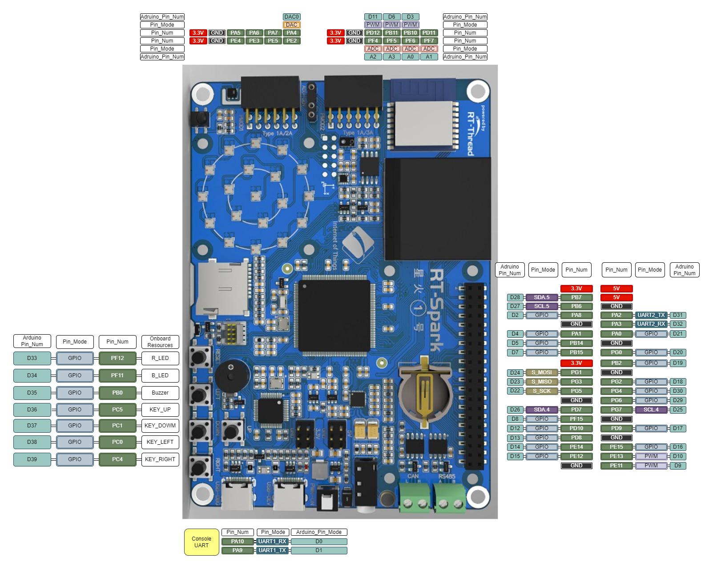

# stm32f407-rt-spark 开发板的Arduino生态兼容说明

## 1 RTduino - RT-Thread的Arduino生态兼容层

stm32f407-rt-spark 开发板已经完整适配了[RTduino软件包](https://github.com/RTduino/RTduino)，即RT-Thread的Arduino生态兼容层。用户可以按照Arduino的编程习惯来操作该BSP，并且可以使用大量Arduino社区丰富的库，是对RT-Thread生态的极大增强。更多信息，请参见[RTduino软件包说明文档](https://github.com/RTduino/RTduino)。

### 1.1 如何开启针对本BSP的Arduino生态兼容层

Env 工具下敲入 menuconfig 命令，或者 RT-Thread Studio IDE 下选择 RT-Thread Settings：

```Kconfig
Hardware Drivers Config --->
    Onboard Peripheral Drivers --->
        [*] Compatible with Arduino Ecosystem (RTduino)
```

## 2 Arduino引脚排布

更多引脚布局相关信息参见 [pins_arduino.c](pins_arduino.c) 和 [pins_arduino.h](pins_arduino.h)。



| Arduino引脚编号  | STM32引脚编号 | 5V容忍 | 备注  |
| ------------------- | --------- | ---- | ------------------------------------------------------------------------- |
| 0 (D0) | GET_PIN(A, 10) | 是 | Serial-RX,默认被RT-Thread的UART设备框架uart1接管 |
| 1 (D1) | GET_PIN(A, 9) | 是 | Serial-TX,默认被RT-Thread的UART设备框架uart1接管 |
| 2 (D2) | GET_PIN(A, 8) | 是 |  |
| 3 (D3) | GET_PIN(B, 10) | 是 | PWM2-CH3,默认被RT-Thread的PWM设备框架pwm2接管 |
| 4 (D4) | GET_PIN(A, 1) | 是 |  |
| 5 (D5) | GET_PIN(B, 14) | 是 |  |
| 6 (D6) | GET_PIN(B, 11) | 是 | PWM2-CH4,默认被RT-Thread的PWM设备框架pwm2接管 |
| 7 (D7) | GET_PIN(B, 15) | 是 |  |
| 8 (D8) | GET_PIN(F, 15) | 是 |  |
| 9 (D9) | GET_PIN(E, 11) | 是 | PWM1-CH2,默认被RT-Thread的PWM设备框架pwm1接管 |
| 10 (D10) | GET_PIN(E, 13) | 是 | PWM1-CH3,默认被RT-Thread的PWM设备框架pwm1接管 |
| 11 (D11) | GET_PIN(D, 12) | 是 | PWM4-CH1,默认被RT-Thread的PWM设备框架pwm4接管 |
| 12 (D12) | GET_PIN(D, 10) | 是 |  |
| 13 (D13) | GET_PIN(D, 8) | 是 |  |
| 14 (D14) | GET_PIN(E, 14) | 是 |  |
| 15 (D15) | GET_PIN(E, 12) | 是 |  |
| 16 (D16) | GET_PIN(E, 15) | 是 |  |
| 17 (D17) | GET_PIN(D, 9) | 是 |  |
| 18 (D18) | GET_PIN(G, 2) | 是 |  |
| 19 (D19) | GET_PIN(B, 2) | 是 |  |
| 20 (D20) | GET_PIN(G, 0) | 是 |  |
| 21 (D21) | GET_PIN(A, 0) | 是 |  |
| 22 (D22) | GET_PIN(G, 5) | 是 | SSPI1-SCK,默认被RT-Thread的SPI设备框架sspi1接管|
| 23 (D23) | GET_PIN(G, 3) | 是 | SSPI1-MISO,默认被RT-Thread的SPI设备框架sspi1接管 |
| 24 (D24) | GET_PIN(G, 1) | 是 | SSPI1-MOSI,默认被RT-Thread的SPI设备框架sspi1接管 |
| 25 (D25) | GET_PIN(G, 7) | 是 | I2C1-SCL,默认被RT-Thread的I2C设备框架i2c1接管 |
| 26 (D26) | GET_PIN(D, 7) | 是 | I2C1-SDA,默认被RT-Thread的I2C设备框架i2c1接管 |
| 27 (D27) | GET_PIN(B, 6) | 是 | I2C2-SCL,默认被RT-Thread的I2C设备框架i2c2接管 |
| 28 (D28) | GET_PIN(B, 7) | 是 | I2C2-SDA,默认被RT-Thread的I2C设备框架i2c2接管 |
| 29 (D29) | GET_PIN(G, 6) | 是 |  |
| 30 (D30) | GET_PIN(G, 4) | 是 |  |
| 31 (D31) | GET_PIN(A, 2) | 是 | Serial2-TX,默认被RT-Thread的UART设备框架uart2接管 |
| 32 (D32) | GET_PIN(A, 3) | 是 | Serial2-RX,默认被RT-Thread的UART设备框架uart2接管 |
| 33 (D33) | GET_PIN(F, 12) | 是 | 板载用户R_LED |
| 34 (D34) | GET_PIN(F, 11) | 是 | 板载用户B_LED |
| 35 (D35) | GET_PIN(B, 0) | 是 | 板载蜂鸣器 |
| 36 (D36) | GET_PIN(C, 5) | 是 | 板载按键KEY_UP |
| 37 (D37) | GET_PIN(C, 1) | 是 | 板载按键KEY_DOWM |
| 38 (D38) | GET_PIN(C, 0) | 是 | 板载按键KEY_LEFT |
| 39 (D39) | GET_PIN(C, 4) | 是 | 板载按键KEY_RIGHT |
| 40 (A0) | GET_PIN(F, 6) | 是 | ADC3-CH4,默认被RT-Thread的ADC设备框架adc3接管 |
| 41 (A1) | GET_PIN(F, 7) | 是 | ADC3-CH5,默认被RT-Thread的ADC设备框架adc3接管 |
| 42 (A2) | GET_PIN(F, 4) | 是 | ADC3-CH14,默认被RT-Thread的ADC设备框架adc3接管 |
| 43 (A3) | GET_PIN(F, 5) | 是 | ADC3-CH15,默认被RT-Thread的ADC设备框架adc3接管 |
| 44 (DAC0) | GET_PIN(A, 4) | 否 | DAC1-CH1,默认被RT-Thread的DAC设备框架dac1接管 |
